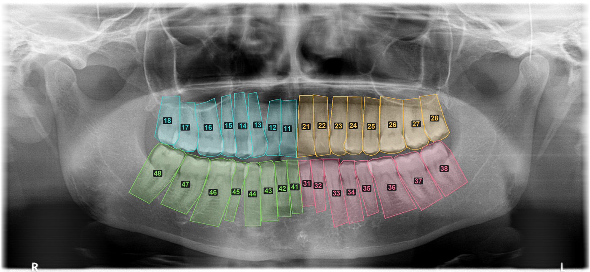
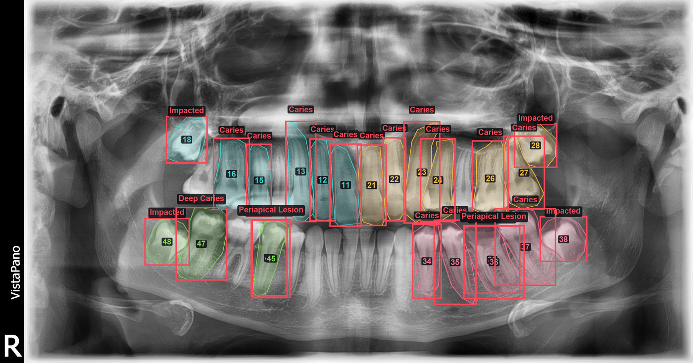

# dental-vision

Odontograma automático a partir de radiografías panorámicas: detectar cada pieza
dental, numerarla según la notación FDI y registrar su estado visible.



*Las 32 piezas segmentadas y numeradas. Un color por cuadrante. La marca `R` de
la esquina inferior izquierda confirma la convención radiológica: la derecha del
paciente aparece a la izquierda de la imagen.*

## El problema

Rellenar el odontograma de un paciente nuevo son entre cinco y diez minutos de
trabajo manual, pieza por pieza, en cada primera visita. Es tedioso, repetitivo y
se hace con prisa. Este proyecto genera el borrador automáticamente para que el
profesional solo tenga que revisarlo.

## Qué es y qué no es

Esto **registra el estado presente** (qué piezas hay, cuáles llevan corona,
implante o endodoncia). Es documentación clínica.

Esto **no diagnostica**. No dice si hay caries ni sugiere tratamiento. Esa
distinción no es cosmética: en la UE, un software destinado a proporcionar
información para decisiones diagnósticas o terapéuticas es producto sanitario y
requiere marcado CE conforme al MDR 2017/745. Este proyecto se mantiene
deliberadamente fuera de esa categoría.

**No es apto para uso clínico.** Es un proyecto de investigación y aprendizaje.

## Datos

[DENTEX Challenge 2023](https://zenodo.org/records/7812323), licencia CC BY 4.0.

| Subconjunto | Imágenes | Anotaciones |
|---|---|---|
| Enumeración | 634 | 18.095 piezas con cuadrante + posición FDI |
| Patología | 705 | 3.529 hallazgos (caries, caries profunda, lesión periapical, impactado) |

Las anotaciones traen polígonos de segmentación (mediana de 12 puntos), no solo
cajas delimitadoras.



*El subconjunto de patología, con los hallazgos marcados en rojo. Este proyecto
no diagnostica: el objetivo es el odontograma. Se documenta aquí porque forma
parte del dataset.*

El dataset no se versiona aquí. Para obtenerlo:

```sh
sh scripts/descargar_dentex.sh
```

## Auditoría del dataset

Antes de entrenar nada se revisó la calidad de las anotaciones. Dos hallazgos:

**1. Las anotaciones son coherentes con la epidemiología real.** La posición 8
(cordales) aparece un 40% menos que el resto, y el primer molar inferior (36/46)
aparece menos que su equivalente superior (16/26) — es el diente que más caries y
extracciones acumula a lo largo de la vida. Que los datos reproduzcan un hecho
clínico conocido sin que nadie se lo pida es una señal fuerte de que el mapeo de
cuadrantes y posiciones es correcto.

**2. Un 2,5% de las imágenes tiene errores de anotación.** 16 de las 634 imágenes
contienen números FDI duplicados, lo que es anatómicamente imposible. En al menos
un caso hay dos series de anotaciones superpuestas y desplazadas una posición
sobre el mismo cuadrante.

La detección es automática y usa una restricción del dominio como test: una boca
no puede tener dos dientes con el mismo número.

```python
from dentalvision.dentex import Subconjunto
corruptas = [r for r in Subconjunto("enumeracion").radiografias if r.duplicados]
```

## Puesta en marcha

```sh
uv sync
sh scripts/descargar_dentex.sh
```

Requiere Python 3.12. El entrenamiento corre en CPU por decisión medida
(ver más abajo), no en el backend Metal.

## Estructura

```
src/dentalvision/
  dentex.py       carga del dataset, composición del número FDI, control de calidad
  render.py       dibujo de polígonos y etiquetas sobre la radiografía
  particiones.py  separación reproducible entrenamiento/validación/prueba
  datos.py        Dataset de torchvision, máscaras y aumentación
  modelo.py       Mask R-CNN con transfer learning
  evaluacion.py   métricas de dominio
scripts/
  descargar_dentex.sh
  entrenar.py
```

Entrenamiento:

```sh
uv run python scripts/entrenar.py --epocas 12 --ancho 800 --lote 2
```

## Decisiones técnicas

Cuatro decisiones tomadas con una medición delante, no por costumbre.

**Entrenamiento en CPU, no en GPU.** Mask R-CNN tarda 107 s por paso en el
backend Metal (MPS) de un Apple M4 y 4 s en la CPU del mismo equipo: la CPU es
17 veces más rápida. La causa es que sus operaciones dispersas (`roi_align`,
`nms`) carecen de kernel MPS y hacen *fallback* a CPU, con copias y
sincronizaciones constantes. MPS rinde en cómputo denso y regular; sufre con
modelos de detección. Dar por hecho que la GPU gana habría convertido un
entrenamiento de 3 horas en uno de 8 horas por época.

**128 regiones ROI en lugar de 512.** Los valores por defecto de torchvision
están pensados para COCO, donde los objetos aparecen en cualquier posición y
número. Una boca tiene como mucho 32 piezas, siempre en una banda central y en
orden previsible. Medido: reducir a 128 ROIs y 500 propuestas RPN acelera un 32%,
y por debajo de 128 ya no se gana nada. Reducir la resolución de 800 a 512 px,
en cambio, solo ahorra un 11% — lo que confirma que el coste está en las cabezas
y no en el backbone.

**Mask R-CNN de torchvision (BSD), no Ultralytics YOLO (AGPL-3.0).** La AGPL
obligaría a publicar el código completo de cualquier servicio que use el modelo,
o a adquirir licencia comercial. La decisión de licencia se toma al principio del
proyecto, no cuando ya hay un cliente. Mismo criterio al elegir el dataset:
DENTEX (CC BY 4.0) frente a alternativas CC BY-NC.

**El volteo horizontal remapea los cuadrantes.** Es la aumentación más común y
en imagen médica lateralizada es destructiva: al voltear, el diente 16 pasa a
ocupar la posición del 26. Sin remapear las etiquetas (1↔2, 3↔4), la mitad de
los ejemplos enseñan lo contrario que la otra mitad, el entrenamiento no da
ningún error y el modelo simplemente nunca aprende a distinguir izquierda de
derecha.

## Métricas

Se reportan tres medidas de dominio en lugar de mAP, que no significa nada para
un clínico:

| Métrica | Qué mide |
|---|---|
| Cobertura | De las piezas presentes, cuántas se encuentran |
| Numeración | De las encontradas, a cuántas se les asigna el FDI correcto |
| Odontogramas perfectos | En cuántas radiografías sale todo bien, sin un solo fallo |

La tercera es la que decide si la herramienta se usa. Un 97% de numeración
correcta suena excelente, pero con 28 piezas por boca son 0,84 errores por
radiografía: el profesional tiene que revisarlo todo igualmente y el ahorro de
tiempo desaparece.

## Estado

- [x] Descarga reproducible y auditoría de anotaciones
- [x] Carga del dataset y composición FDI
- [x] Visor de anotaciones
- [x] Separación entrenamiento/validación (432 / 93 / 93, semilla fija)
- [ ] Detector de piezas dentales (bucle verificado, sin entrenar aún)
- [ ] Post-procesado con restricciones anatómicas
- [ ] Odontograma visual
- [ ] Evaluación

## Licencia

Código bajo licencia MIT. Las imágenes de `docs/` proceden del dataset DENTEX
(CC BY 4.0) y se reproducen con atribución.

## Atribución

Dataset DENTEX 2023, publicado bajo CC BY 4.0. Hamamci et al., *DENTEX: An
Abnormal Tooth Detection with Dental Enumeration and Diagnosis Benchmark for
Panoramic X-rays*.
