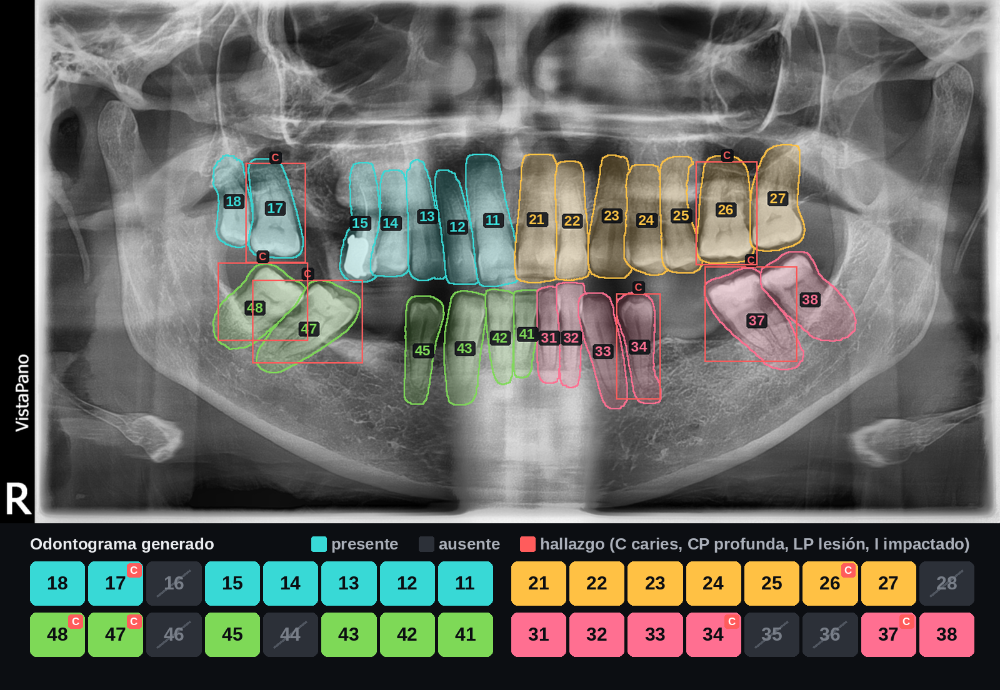

# dental-vision

Odontograma automático a partir de radiografías panorámicas: detectar cada pieza
dental, numerarla según la notación FDI y marcar sus hallazgos (caries, caries
profunda, lesión periapical, diente impactado).


*Predicción del modelo sobre una radiografía de la partición de prueba, que no vio al entrenar: las 32 piezas encontradas y bien numeradas. Es la radiografía típica, no la mejor: se eligió la primera de la partición con el número de fallos mediano, que es cero. Debajo, el odontograma que genera.*

## El problema

Rellenar el odontograma de un paciente nuevo son entre cinco y diez minutos de
trabajo manual, pieza por pieza, en cada primera visita. Es tedioso, repetitivo y
se hace con prisa. Este proyecto genera el borrador automáticamente para que el
profesional solo tenga que revisarlo.

## Qué es y qué no es

Son dos modelos. El primero **registra qué piezas hay y qué número tiene cada
una**: documentación clínica. El segundo **señala hallazgos** (caries, caries
profunda, lesión periapical, diente impactado) y los coloca en su casilla del
odontograma. Anotar restauraciones (corona, implante, endodoncia) no se puede
aprender de DENTEX: no las etiqueta.

El segundo modelo ya es apoyo al diagnóstico, y en la UE un software destinado a
proporcionar información para decisiones diagnósticas o terapéuticas es producto
sanitario y requiere marcado CE conforme al MDR 2017/745. Incluso el odontograma
solo entra en la historia clínica y se usa para planificar tratamientos. Un uso
clínico real habría que tratarlo como producto sanitario.

**No es apto para uso clínico.** Es un proyecto de investigación y aprendizaje.

## Resultados: numeración

Partición de prueba: 91 radiografías que el modelo no vio al entrenar y que no se
usaron para elegir nada. Entre paréntesis, intervalo de confianza del 95%
(bootstrap por radiografía).

| Post-procesado | Cobertura | Numeración | Exactitud | Errores por radiografía | Odontogramas perfectos |
|---|---|---|---|---|---|
| Ninguno | 98,6% (98,0–99,1) | 96,6% (95,1–97,9) | 95,2% (93,6–96,8) | 1,81 (1,26–2,36) | 48,4% (38,5–59,3) |
| Unicidad | 98,6% (97,9–99,2) | 96,7% (95,3–98,1) | 95,4% (93,7–97,0) | 1,66 (1,13–2,20) | 52,7% (42,9–63,7) |
| Unicidad + orden | 98,7% (98,1–99,2) | 96,7% (95,3–98,1) | 95,5% (93,9–97,1) | 1,64 (1,11–2,18) | 53,8% (44,0–64,8) |

Con unas 29 piezas por radiografía, el borrador sale perfecto en 49 de las 91 y de media hay que corregir 1,6 piezas. La distribución es desigual: 61 radiografías tienen como mucho un fallo y 19 acumulan tres o más. En validación: 2,08 errores y 55% de odontogramas perfectos, cifras parecidas, así que no hay sobreajuste a la validación.

**Dónde falla.** Casi todos los fallos son de numeración en premolares y molares: piezas que se parecen a sus vecinas y que, cuando falta alguna, se prestan a correr la numeración un puesto. Las bocas con muchas ausencias concentran los errores.

| Posición | Mal numeradas | No encontradas | Sobrantes |
|---|---|---|---|
| 1 incisivo central | 7 | 7 | 4 |
| 2 incisivo lateral | 8 | 2 | 3 |
| 3 canino | 7 | 7 | 4 |
| 4 primer premolar | 14 | 10 | 8 |
| 5 segundo premolar | 10 | 6 | 7 |
| 6 primer molar | 16 | 1 | 0 |
| 7 segundo molar | 17 | 1 | 1 |
| 8 cordal | 5 | 0 | 4 |


*Un caso difícil, elegido con regla fija (la primera radiografía en el percentil 90 de fallos: cinco). El fallo típico: el modelo corre un puesto la numeración del cuadrante inferior izquierdo, del incisivo central al segundo premolar. Cada pieza es plausible por sí sola y el orden se respeta, por eso el post-procesado no lo detecta. En rojo, los fallos: «31>41» es una pieza que el modelo numeró 31 y es la 41.*

## Resultados: hallazgos

Evaluado en los dos conjuntos oficiales del concurso DENTEX, que el modelo no vio
al entrenar: la validación oficial (50 radiografías, las 4 clases) y la prueba
oficial (250 radiografías). La prueba oficial se publicó con las etiquetas
clínicas originales, en turco y con más categorías; solo se usan las tres cuya
traducción no admite duda (caries, impactado, lesión periapical), y las
proporciones entre ellas coinciden con las del entrenamiento, señal de que la
traducción es correcta. AP al estilo COCO, la métrica oficial; entre paréntesis,
intervalo del 95% por bootstrap de radiografías.

| | Validación oficial | Prueba oficial |
|---|---|---|
| AP diagnóstico | 0,33 (0,25–0,41) | 0,35 (0,33–0,39) |
| AP50 | 0,51 (0,38–0,62) | 0,54 (0,50–0,59) |
| AP impactado | 0,50 | 0,57 |
| AP caries | 0,20 | 0,24 |
| AP caries profunda | 0,26 | — |
| AP lesión periapical | 0,36 (solo 9 casos) | 0,24 |
| AP cuadrante / número* | 0,41 / 0,30 | 0,37 / 0,25 |

\* Uniendo cada hallazgo a su diente con el modelo de numeración. Solo en las
radiografías que ese modelo no vio al entrenar (35 y 182), porque parte de los
conjuntos oficiales está también en el subconjunto de enumeración.

Como referencia, el método de los organizadores (HierarchicalDet, un detector
por difusión) obtuvo un AP de diagnóstico de 0,37 en la prueba oculta del
concurso ([resultados](https://dentex.grand-challenge.org/evaluation/5f696fc0-8822-41ad-bab9-553dd812d782/)).
La comparación es orientativa: no es exactamente el mismo conjunto ni las mismas
clases.

En términos clínicos, con el umbral de confianza elegido en validación (0,5):

| Hallazgo (prueba oficial) | Casos | Encontrados | De lo marcado, real | Falsas alarmas por radiografía |
|---|---|---|---|---|
| Impactado | 221 | 90% | 86% | 0,13 |
| Caries | 747 | 47% | 44% | 1,83 |
| Lesión periapical | 75 | 36% | 48% | 0,12 |

Los dientes impactados se detectan bien: son grandes y su posición es anómala.
Las caries son el punto débil: encuentra la mitad y marca casi dos falsas por
radiografía, y confunde a menudo caries con caries profunda, que es una
diferencia de grado. Tal como está, sirve para señalar dónde mirar, no para
fiarse de lo que no marca.



*Validación oficial, elegida con regla fija (la radiografía con el número
mediano de hallazgos reales entre las que ningún modelo vio: tres). La anotación
dice 18 impactado y 37 y 47 con caries profunda. El modelo encuentra el 37 y el
47 pero los clasifica como caries simple, no ve el 18 y marca caries en 17, 26,
34 y 48. Es el retrato fiel de las cifras de arriba.*

## Datos

[DENTEX Challenge 2023](https://zenodo.org/records/7812323), licencia CC BY 4.0.

| Subconjunto | Imágenes | Anotaciones |
|---|---|---|
| Enumeración | 634 | 18.095 piezas con cuadrante + posición FDI |
| Patología | 705 | 3.529 hallazgos (caries, caries profunda, lesión periapical, impactado) |
| Validación oficial | 50 | 182 hallazgos, 4 clases |
| Prueba oficial | 250 | 1.600 etiquetas clínicas originales (LabelMe, en turco) |

Las anotaciones traen polígonos de segmentación (mediana de 12 puntos), no solo
cajas delimitadoras.


*Anotaciones del dataset (no es una predicción): las 32 piezas segmentadas y
numeradas, un color por cuadrante. La marca `R` de la esquina inferior izquierda
confirma la convención radiológica: la derecha del paciente aparece a la izquierda
de la imagen.*


*Anotaciones del subconjunto de patología, con los hallazgos marcados en rojo.*

El dataset no se versiona aquí. Para obtenerlo:

```sh
sh scripts/descargar_dentex.sh
```

Zenodo puede ir muy lento (medido: 0,6 MB/s, cinco horas para los 10 GB). Los
autores publican el mismo fichero en Hugging Face, bastante más rápido; el script
lo acepta con `DENTEX_URL` y comprueba el MD5 que publica Zenodo, así que el
resultado es idéntico byte a byte. Ojo con la licencia: el registro de Zenodo dice
CC BY 4.0 y la ficha de Hugging Face, CC BY-NC-SA 4.0. Este proyecto se apoya en la
del registro oficial, pero la discrepancia importaría en un uso comercial.

## Auditoría del dataset

Antes de entrenar nada se revisó la calidad de las anotaciones. Tres hallazgos:

**1. Las anotaciones son coherentes con la epidemiología real.** La posición 8
(cordales) aparece un 37% menos que la media del resto, y el primer molar inferior
(36/46) un 14% menos que su equivalente superior (16/26) — es el diente que más
caries y extracciones acumula a lo largo de la vida. Que los datos reproduzcan un hecho
clínico conocido sin que nadie se lo pida es una señal fuerte de que el mapeo de
arcadas y posiciones es correcto. Izquierda y derecha no las distingue (la
epidemiología es simétrica); eso lo confirma la marca `R` de las radiografías.

**2. Un 2,5% de las imágenes tiene errores de anotación.** 16 de las 634 imágenes
contienen números FDI duplicados, lo que es anatómicamente imposible. En al menos
un caso hay dos series de anotaciones superpuestas y desplazadas una posición
sobre el mismo cuadrante.

La detección es automática y usa una restricción del dominio como test: una boca
no puede tener dos dientes con el mismo número.

```python
from dentalvision.dentex import Subconjunto
corruptas = [r for r in Subconjunto("enumeracion").radiografias if r.duplicados]
```

**3. Hay radiografías repetidas con distinto nombre.** Comparando el MD5 de los
ficheros: 11 copias exactas dentro de enumeración y 27 dentro de patología, una
radiografía de la prueba oficial que también está en el entrenamiento de
patología, y 103 de los conjuntos oficiales que están en enumeración. Sin
comprobarlo, una radiografía de la partición de prueba estaba también en
entrenamiento. Ahora `particiones.py` excluye las copias (y, para patología, todo
lo que está en los conjuntos oficiales). El efecto en las cifras fue pequeño
(1,69 → 1,64 errores por radiografía), pero una fuga así es fácil de pasar por
alto y puede ser mucho mayor en otros datasets.

## Puesta en marcha

```sh
uv sync
sh scripts/descargar_dentex.sh
```

Requiere Python 3.12 (uv lo instala solo) y, para entrenar en un tiempo razonable,
una GPU NVIDIA con CUDA.

```sh
uv run python scripts/entrenar.py --nombre base              # ~20 min en una RTX 4060 Ti
uv run python scripts/evaluar.py --ejecucion base            # ajusta el post-procesado en validación
uv run python scripts/evaluar.py --ejecucion base --particion prueba
uv run python scripts/entrenar.py --tarea patologia --nombre patologia --epocas 30
uv run python scripts/evaluar_patologia.py --ejecucion patologia --numeracion base
uv run python scripts/odontograma.py --ejecucion base --patologia patologia --imagen panoramica.png
uv run python scripts/animacion.py --ejecucion base --patologia patologia --imagen panoramica.png --salida demo.gif
uv run pytest
```

## Estructura

```
src/dentalvision/
  dentex.py       carga del dataset, composición del número FDI, control de calidad
  render.py       dibujo de anotaciones, predicciones y odontograma
  particiones.py  separación reproducible entrenamiento/validación/prueba
  datos.py        Dataset de torchvision, máscaras y aumentación
  modelo.py       Mask R-CNN con transfer learning
  postproceso.py  restricciones anatómicas: unicidad y orden de las piezas
  evaluacion.py   métricas de dominio, AP al estilo COCO e intervalos de confianza
  inferencia.py   de una radiografía a sus piezas y hallazgos (lo usan scripts y demo)
scripts/
  descargar_dentex.sh
  entrenar.py     entrenamiento; guarda cada ejecución en modelos/<nombre>/
  evaluar.py      ajuste en validación y evaluación final en prueba
  comparar.py     comparación de ejecuciones con bootstrap emparejado
  evaluar_patologia.py  hallazgos en los conjuntos oficiales del concurso
  odontograma.py  figura de una radiografía con su odontograma
  animacion.py    GIF o vídeo del proceso
tests/
```

## Decisiones técnicas

Decisiones tomadas con una medición delante, no por costumbre.

**La resolución la decide el Dataset, no torchvision.** Mask R-CNN reescala cada
imagen por dentro: el lado corto a 800 px sin que el largo pase de 1.333. Con una
panorámica, la red trabaja siempre a unos 1.333 px de ancho, se le dé lo que se le
dé. La primera versión de este proyecto reducía las radiografías a 800 px y la red
las volvía a ampliar: se perdía detalle a cambio de nada. Eso también invalidaba
una medición anterior («reducir de 800 a 512 px solo ahorra un 11%, luego el coste
está en las cabezas»): la red procesó el mismo tamaño en las dos pruebas. Ahora el
modelo se crea con `min_size = max_size = ancho` y la resolución la fija una sola
constante.

**Entrenamiento en GPU NVIDIA; en un Mac, en CPU.** En una RTX 4060 Ti (8 GB) con
precisión mixta, un paso de entrenamiento (lote de 2 radiografías a 1.333 px)
tarda 0,2 s y ocupa 2,5 GB: una época con su validación, 50 segundos; las 24
épocas, 20 minutos. En un Apple M4, según las mediciones de la primera versión
de este proyecto, la CPU tardaba unos 4 s por paso (casi 6 horas para 24 épocas)
y el backend Metal (MPS) era mucho más lento todavía, unos 107 s. La causa no está identificada: torchvision 0.28 sí tiene kernels MPS
para `roi_align` y `nms`, así que no es un *fallback* a CPU de esas operaciones.

*Las dos comparaciones siguientes se hicieron con la partición anterior a
excluir duplicados; las diferencias son internas a cada comparación.*

**128 regiones ROI en lugar de 512.** Los valores por defecto de torchvision
están pensados para COCO, donde los objetos aparecen en cualquier posición y
número. Una boca tiene como mucho 32 piezas, siempre en una banda central y en
orden previsible. En la CPU del Mac, bajar a 128 ROIs y 500 propuestas del RPN
aceleraba un 32%. Faltaba medir si costaba precisión, y no se nota: entrenando
las dos versiones completas en la 4060 Ti, 512 ROIs tardan un 24% más por paso
(0,24 s frente a 0,20) y dan 1,48 errores por radiografía en validación frente a
1,60, una diferencia de −0,12 con intervalo de −0,37 a +0,12 (bootstrap
emparejado, una sola semilla). Dentro del ruido: se quedan las 128.

**Mask R-CNN de torchvision (BSD), no Ultralytics YOLO (AGPL-3.0).** La AGPL
obligaría a publicar el código completo de cualquier servicio que use el modelo,
o a adquirir licencia comercial. La decisión de licencia se toma al principio del
proyecto, no cuando ya hay un cliente. Mismo criterio al elegir el dataset:
DENTEX (CC BY 4.0) frente a alternativas CC BY-NC.

**El volteo horizontal remapea los cuadrantes.** Es la aumentación más común y
en imagen médica lateralizada es destructiva: al voltear, el diente 16 pasa a
ocupar la posición del 26. Sin remapear las etiquetas (1↔2, 3↔4), la mitad de
los ejemplos enseñan lo contrario que la otra mitad, el entrenamiento no da
ningún error y el modelo simplemente nunca aprende a distinguir izquierda de
derecha.

**Restricciones anatómicas después del detector.** El detector decide cada pieza
por separado y su NMS es por clase: una misma pieza puede salir como 16 y como 17
a la vez, y dos piezas distintas pueden recibir el mismo número. El post-procesado
agrupa las detecciones que caen sobre la misma pieza y asigna los números con dos
reglas: cada número una sola vez (algoritmo húngaro) y el orden de la arcada. El
orden se resuelve como un alineamiento de secuencias, igual que en
bioinformática: las piezas, de izquierda a derecha, contra 18…11 21…28, con
huecos permitidos para las que faltan. Cuando el orden obliga a cambiar un número,
se prefiere el vecino más cercano a lo que vio el detector. Medido en prueba, agrupar y exigir unicidad baja los errores de 1,81 a 1,66 por radiografía y los odontogramas perfectos del 48% al 53%: sobre todo quita duplicados y recupera piezas en las que el detector dudaba entre dos números. El orden no añade nada con el modelo final (sí ayudaba a mitad de entrenamiento): el detector ya aprende la secuencia, y los fallos que quedan corren la numeración respetando el orden, así que esa regla no los ve. Se mantiene porque garantiza que el odontograma nunca sea anatómicamente imposible.

**BatchNorm del backbone.** La v2 usa BatchNorm normal, y con lotes de 2 imágenes sus estadísticas se recalculan con muy poca muestra. Congelarla (`FrozenBatchNorm2d`), lo habitual al ajustar con lotes pequeños, no mejora nada medible: 1,67 errores por radiografía en validación frente a 1,60, diferencia +0,06 con intervalo de −0,18 a +0,34. Se queda como viene.

**Los hallazgos, un segundo modelo aparte.** El mismo Mask R-CNN con 4 clases,
entrenado sobre las 705 radiografías de patología, cuyas cajas son los dientes
afectados. Aquí el volteo no remapea nada: una caries en el espejo sigue siendo
una caries. Cada hallazgo se asigna al diente del odontograma que más solapa con
él. Separar las dos tareas permite entrenar cada una con su subconjunto completo;
un solo modelo con las tres etiquetas jerárquicas es la alternativa natural.

**La prueba se mira una vez.** Los umbrales del post-procesado y la elección entre
configuraciones se hacen en validación, y `scripts/evaluar.py` se niega a evaluar
la partición de prueba si no están fijados. Los intervalos de confianza se
calculan remuestreando radiografías, no piezas: los dientes de una misma boca no
son independientes, y tratarlos como tales daría intervalos falsamente estrechos.

## Métricas

Para la numeración se reportan medidas de dominio en lugar de mAP, que no
significa nada para un clínico (para los hallazgos se da también el AP oficial,
para poder compararse con el concurso):

| Métrica | Qué mide |
|---|---|
| Cobertura | De las piezas presentes, cuántas se encuentran |
| Numeración | De las encontradas, a cuántas se les asigna el FDI correcto |
| Exactitud | De las piezas presentes, cuántas salen encontradas y bien numeradas |
| Errores por radiografía | Correcciones que tiene que hacer el profesional: piezas que faltan, números mal puestos y piezas que sobran |
| Odontogramas perfectos | En cuántas radiografías sale todo bien, sin un solo fallo |

Los porcentajes por pieza engañan: un 97% de numeración correcta suena excelente,
pero con 28 piezas por boca son 0,84 errores por radiografía. Como el profesional
revisa siempre el borrador, lo que mide el ahorro de tiempo es cuántas
correcciones tiene que hacer: los errores por radiografía.

## Estado

- [x] Descarga reproducible y auditoría de anotaciones
- [x] Carga del dataset y composición FDI
- [x] Visor de anotaciones
- [x] Separación entrenamiento/validación/prueba (425 / 91 / 91, semilla fija, sin duplicados)
- [x] Detector de piezas dentales
- [x] Post-procesado con restricciones anatómicas
- [x] Odontograma visual
- [x] Evaluación
- [x] Detección de hallazgos y su unión con el odontograma
- [x] Evaluación en los conjuntos oficiales del concurso

Siguientes pasos:

- **Etiquetas jerárquicas.** DENTEX anota cuadrante y posición por separado, y son
  señales visuales distintas: el cuadrante se deduce de dónde está la pieza y la
  posición, de su forma. Entrenar solo la posición (8 clases, unas cuatro veces
  más ejemplos por clase que las 32 actuales) y sacar el cuadrante por geometría
  ataca directamente el error dominante.
- **Caries**: es lo más útil clínicamente y lo más flojo. Más resolución (las
  caries pequeñas ocupan pocos píxeles a 1.333 px) y recortes por diente son lo
  primero a probar.
- **Estado de cada pieza** (corona, implante, endodoncia): requiere otro conjunto
  de datos.
- **Validación externa**, con radiografías de otro centro y otro equipo. La
  partición es por imagen porque DENTEX no publica identificador de paciente
  (ver `particiones.py`).

## Licencia

Código bajo licencia MIT. Las imágenes de `docs/` proceden del dataset DENTEX
(CC BY 4.0) y se reproducen con atribución.

## Atribución

Dataset DENTEX 2023, publicado bajo CC BY 4.0. Hamamci et al., *DENTEX: An
Abnormal Tooth Detection with Dental Enumeration and Diagnosis Benchmark for
Panoramic X-rays*.
